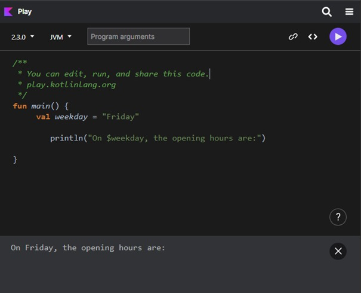
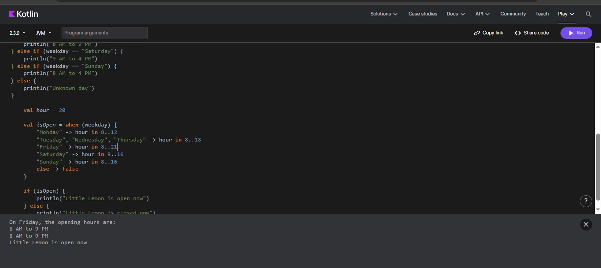

#  📘 Lab 2 — Conditions in Kotlin

## 📚 Course

Fondamentaux de la programmation en Kotlin

### 🎯 Objectives

Use conditional statements: if, if-else-if, when

Display opening hours based on weekday

Determine whether Little Lemon is open or closed

Work with time using the 24-hour format

### ✅ Skills Learned

Conditional logic in Kotlin

when expressions

Boolean conditions

Time range checks (in 8..18)
## resulta 

  
<em>Figure 1</em>
 

  
<em>Figure 2</em>
 

